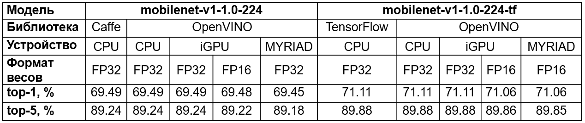
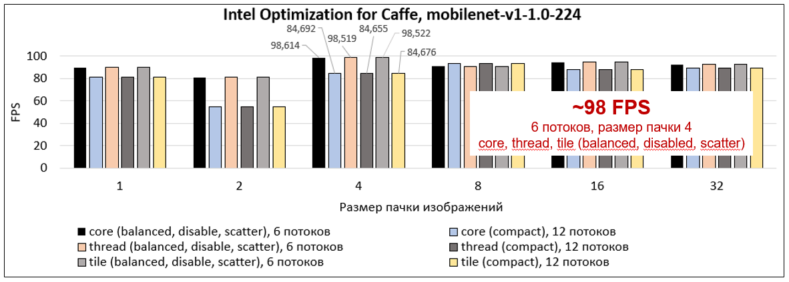
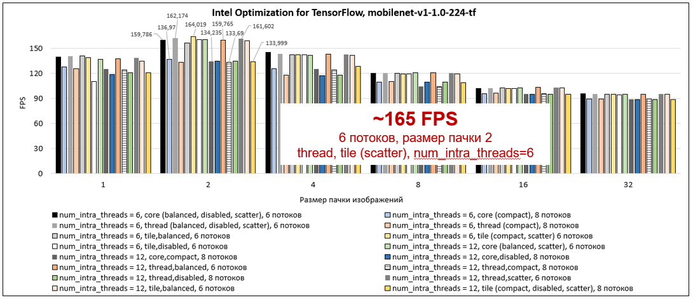
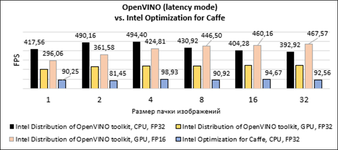
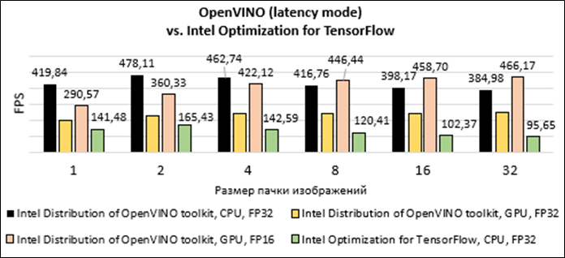
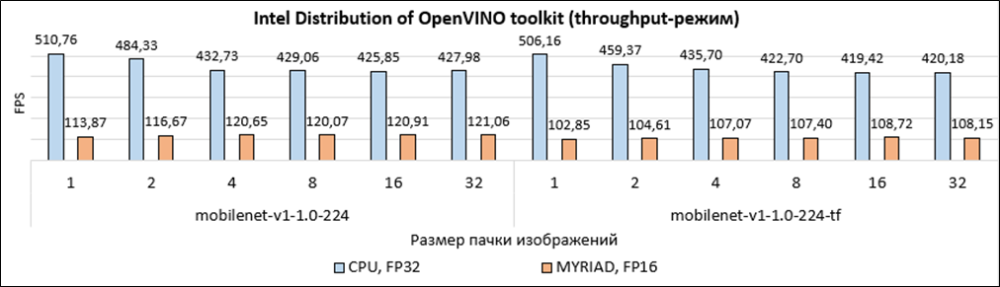

# DLI Benchmark - инструмент для измерения скорости работы моделей глубокого обучения

Каждый фреймворк глубокого обучения использует свой подход к инференсу глубоких моделей и находит компромисс между временем обработки данных, потреблением ресурсов и качеством работы. Результатом такого разнообразия является множество возможных комбинаций из задачи машинного обучения, фреймворка, модели, набора тестовых данных и целевого устройства, что делает задачу оценки производительности инференса крайне трудной. Именно поэтому разрабатываются системы, позволяющие автоматически собирать данные о производительности и качестве работы большого количества моделей.

Существуют программные системы, которые позволяют оценивать производительность вывода широко известных глубоких моделей. Среди систем можно выделить DAWNBench [1], AI Matrix [2] и MLPerf [3]. Deep Learning Inference Benchmark (DLI Benchmark) [4] – одна из таких систем, разрабатываемая в Университете Лобачевского. Отличие данной системы от существующих состоит в том, что результаты производительности вывода собираются на аппаратных решениях Intel (Intel CPUs, Intel Processor Graphics, Intel Movidius Neural Compute Stick). Полученные значения показателей производительности для широкого спектра моделей и некоторых аппаратных конфигураций публикуются в открытом доступе [5]. Система поддерживает реализацию вывода средствами библиотек Intel Distribution of OpenVINO toolkit [6], Intel Optimization for Caffe [7] и Intel Optimization for TensorFlow [8]. Отметим, что OpenVINO обеспечивает конвертацию моделей из формата, в котором они сохраняются в результате обучения, во внутреннее представление, оптимизированное под архитектуры Intel. Как следствие, с использованием DLI можно оценить производительность вывода практически любой пользовательской модели.

### DLI Benchmark

В рамках лаборатории ITLab студентами Университета Лобачевского был разработан открытый фреймворк DLI [github.com/itlab-vision/dl-benchmark](github.com/itlab-vision/dl-benchmark), который позволяет запустить измерение производительности большого количества разных моделей на доступном железе.

Фреймворк разрабатывается с целью максимальной автоматизации процесса тестирования большого количества моделей на разнородном оборудовании путем автоматизации процесса тестирования на большом количестве вычислительных узлов.

Архитектура системы

Разрабатываемая система состоит из нескольких основных компонент:

1. **ConfigMaker** – графическое приложение для автоматизации процедуры формирования конфигурационных файлов для разных запускаемых компонент системы. Приложение является самостоятельным и не зависит от остальных компонент системы.
1. **Deployment** – компонент, обеспечивающий автоматическое развертывание тестовой инфраструктуры на вычислительных узлах средствами технологии Docker. Информация о вычислительных узлах содержится в конфигурационном файле компонента.
1. **BenchmarkApp** – компонент, отвечающий за сбор показателей производительности вывода набора моделей с использованием различных инструментов глубокого обучения. Информация о моделях и параметрах запуска вывода содержится в конфигурационном файле компонента.
1. **Inference** – компонент, содержащий реализацию вывода глубоких нейросетевых моделей с помощью различных инструментов глубокого обучения. Используется компонентом BenchmarkApp для непосредственного запуска вывода нейросетей с заданными параметрами.
1. **AccuracyChecker** – компонент, обеспечивающий оценку качества работы моделей на открытых данных. Является надстройкой над аналогичным компонентом в OpenVINO [a16].
1. **RemoteController** – компонент, выполняющий удаленный запуск экспериментов для определения производительности и качества глубоких моделей на вычислительных узлах.
1. **Converters** – вспомогательный компонент, содержащий различные конвертеры для удобного представления результатов производительности и качества работы моделей. В частно-сти, данный компонент обеспечивает преобразование выходных данных в HTML-формат для публикации результатов экспериментов на странице проекта [5].

*Схема связи компонентов системы*

Программная реализация выполнена на языке Python. Обеспечивается поддержка вывода с использованием библиотек Intel Distribution of OpenVINO toolkit [6], Intel Optimization for Caffe [7] и Intel Optimization for TensorFlow [8]. Графическое приложение для автоматизации формирования конфигурационных файлов системы разработано с помощью технологии Qt. Исходный код системы выложен в открытый доступ на GitHub [4].

Основной сценарий работы предполагает выполнение следующих действий:

1. **Формирование конфигурационных файлов** с помощью ConfigMaker для компонент Deployment, RemoteController, BenchmarkApp и AccuracyChecker.
1. **Развертывание тестовой инфраструктуры на вычислительных узлах** с использованием компонента Deployment. Все необходимые данные для запуска экспериментов хранятся на FTP-сервере. На данном этапе выполняется подготовка структуры директорий на FTP-сервере (директории для сохранения конфигурационных файлов, результатов экспериментов и docker-образов целевых машин), копирование шаблонного docker-образа машины с готовой тестовой инфраструктурой на FTP-сервер, удаленное скачивание docker-образа с FTP-сервера на вычислительный узел и локальное развертывание docker-образа, копирование конфигураций проводимых экспериментов локально на узел.
1. **Удаленный запуск экспериментов на вычислительных узлах** средствами RemoteController. RemoteController запускает AccuracyChecker, где сначала вычисляются метрики качества исходных моделей. Далее RemoteController запускает BenchmarkApp для определения показателей производительности вывода. BenchmarkApp использует компонент Inference для запуска вывода отдельной модели из перечня проводимых экспериментов, каждая модель запускается средствами OpenVINO и исходного фреймворка, в котором она была обучена, если DLI поддерживает данный фреймворк для запуска вывода. После всех вычислений RemoteController формирует файл с результатами экспериментов на FTP-сервере.
1. **Конвертирование таблицы результатов в HTML-формат** средствами Converters. Данный компонент преобразовывает таблицы с результатами работы компонент BenchmarkApp и AccuracyChecker в HTML-формат для их публикации на официальной странице проекта.

### Показатели производительности моделей глубокого обучения
Intel Distribution of OpenVINO toolkit поддерживает два режима вывода.

1. Режим минимизации времени выполнения одного запроса (**Latency mode**). Предполагает создание и выполнение одного запроса для вывода модели на выбранном устройстве. Сле-дующий запрос на вывод создается по завершении предыдущего. Количество сгенерированных запросов определяется числом итераций цикла тестирования модели.
1. Режим минимизации времени выполнения набора запросов (**Throughput mode**). Предполагает создание набора запросов для вывода нейронной сети на выбранном устройстве. Порядок выполнения запросов может быть произвольным. Количество наборов запросов определяется количеством итераций цикла тестирования модели.

Как мы вычисляем показатели производительности

При оценке производительности вывода для latency-режима запросы выполняются последовательно. Для каждого запроса измеряется продолжительность его выполнения. Стандартное отклонение рассчитывается на основе набора полученных длительностей, а те, которые выходят за пределы трех стандартных отклонений относительно среднего времени вывода, отбрасываются. Результирующий набор времен используется для вычисления латентности – медианы времен выполнения. На основании латентности рассчитывается среднее количество кадров, обрабатываемых за секунду (Frames per Second, FPS) – отношение размера пачки изображений к латентности. Для режима минимизации времени выполнения набора запросов вычисляется среднее количество кадров, обрабатываемых за секунду (Frames per Second, FPS) как отношение произведения размера пачки изображений и числа итераций тестирования ко времени выполнения всех запросов. Intel Optimization for Caffe и Intel Optimization for TensorFlow работают только в одном режиме, аналогичном latency-режиму. Поэтому для них справедлив показатель FPS, который введен для данного режима работы OpenVINO.

### Результаты экспериментов и анализ производительности на примере модели MobileNet [9]

Характеристики тестового стенда

* CPU:  Intel Core i7-8700 3.20GHz (6 ядер и 12 потоков)
* iGPU: Intel Gen9 HD Graphics (iGPU)
* VPU:  Intel Neural Compute Stick 2 with Intel Movidius Myriad X Vision Processing Unit
* RAM: 64 GB
* OS: Ubuntu 18.04
* Библиотеки:
  * Intel Distribution of OpenVINO toolkit 2021.4
  * Intel Optimizations for TensorFlow 1.15.2
  * Intel Optimizations for Caffe 1.11

Для проверки качества работы моделей на задаче классификации используются показатели точности top-1 и top-5. 

Для доказательства корректности работы моделей приведем результаты, полученные с использованием разработанного компонента AccuracyChecker. Полученные значения точности top-1 и top-5 приведены в таблице ниже. Из этих результатов можно сделать вывод, что показатели точности соответствуют тем, которые получены с использованием оригинальных фреймворков. Небольшие отличия обусловлены оптимизациями, выполняемыми пакетом OpenVINO в процессе конвертации весов моделей в формат половинной точности.

Таблица качества работы моделей

*Точность top-1 и top-5 для моделей mobilenet-v1-1.0-224 и mobilenet-v1-1.0-224-tf, обученных в оригинальных фреймворках Caffe и TensorFlow, а также точность соответствующих моделей, сконвертированных с использованием OpenVINO под устройства Intel CPUs (CPU), Intel Processor Graphics (iGPU) и Intel Movidius Neural Compute Stick 2 (MYRIAD)*

  

Анализ результатов производительности требует подбора оптимальных параметров запуска вывода на предоставляемом вычислительном узле (числа потоков и ряда других). В [10] показано, что оптимальными являются параметры по умолчанию. Далее выполняется подбор параметров для библиотек Intel Optimization for Caffe и Intel Optimization for TensorFlow.

Подбор оптимальных параметров для Intel Optimization for Caffe

Для библиотеки Caffe перебираются значения двух параметров: количество параллельно запускаемых потоков и расположение потоков на ядрах системы (задается через переменную окружения KMP_AFFINITY). Для каждого сценария расположения потоков перебираются значения числа потоков, равные 1, 2, 4, 6, 8, 12. При этом рассматриваются размеры обрабатываемой пачки изображений 1, 2, 4, 8, 16, 32. Выбирается оптимальное количество потоков для каждого возможного сценария. Оно соответствует числу физических или логических ядер на узле. Полученные результаты приведены на рисунке 2. Лучшая производительность ~98 fps достигается на 6 потоках при использовании сценариев распределения core (balanced, disabled, scatter), thread (balanced, disabled, scatter) и tile (balanced, disabled, scatter) при размере пачки в 4 изображения. При увеличении размера пачки наблюдается падение производительности (на 8 изображениях FPS выравнивается около 90, далее при 16 – ~94, а при 32 – ~92. Данный факт можно объяснить неэффективным доступом к кэш-памяти.

*Подбор параметров запуска вывода для Intel Optimization for Caffe. Значения FPS для каждого допустимого сценария расположения потоков на ядрах системы при оптимальном количестве потоков:*

  

Подбор оптимальных параметров для Intel Optimization for TensorFlow

Для библиотеки TensorFlow перебираются значения двух аналогичных параметров. Следует отметить, что наряду с этими параметрами имеются еще два других. num_intra_threads контролирует параллелизм внутри операции (например, матричное умножение может выполняться в несколько потоков). num_inter_threads контролирует параллелизм между независимыми операциями топологии. num_intra_threads выбирается равным числу физических ядер, а num_inter_threads – количеству вычислительных устройств с общим кэшем (сокетов). Данный выбор обусловлен рекомендациями из [11]. На рисунке 3 приведены результаты производительности вывода для каждого сценария при оптимальном количестве потоков. Наилучшая производительность ~165 fps достигается на обрабатываемой пачке, состоящей из двух изображений, на 6 потоках для сценариев thread и tile (scatter), num_intra_threads = 6.
Теперь сравним результаты производительности вывода, которые получены при запуске OpenVINO в latency-режиме, Intel Optimization for Caffe и Intel Optimization for TensorFlow при подобранных оптимальных параметрах запуска (рис. 4). Для каждой модели фреймворк OpenVINO при параметрах, заданных по умолчанию, показывает лучшую производительность для каждого размера обрабатываемой пачки изображений, чем соответствующие библиотеки с подобранными оптимальными параметрами. OpenVINO выигрывает более 300 fps у Caffe и не-много меньше у TensorFlow. Данный факт свидетельствует об эффективности оптимизаций нейронной сети, выполняемых на этапе конвертации модели во внутреннее представление биб-лиотеки. Следует также отметить, что запуск на iGPU дает практически вдвое лучшие результаты производительности по сравнению с Caffe и TensorFlow даже для формата FP32, что говорит о перспективности использования Intel Processor Graphics.

*Подбор параметров запуска вывода для Intel Optimization for TensorFlow. Значения FPS для каждого допустимого сценария расположения потоков на ядрах системы при оптимальном числе потоков*

  

После того, как были подобраны оптимальные параметры запуска для фреймворков, можно сравнить производительность между фреймворками. На графиках ниже представлено сравнение производительности моделей в Latency-режиме.

*Сравнение результатов производительности на CPU Intel Distribution of OpenVINO toolkit в latency-режиме (формат весов FP32), Intel Optimization for Caffe и Intel Optimization for TensorFlow при подобранных оптимальных параметрах*

Ниже приведены результаты производительности вывода, полученные при запуске OpenVINO в throughput-режиме. Аналогов, известных авторам, для данного режима не существует. Лучшая производительность достигается на CPU при пачке обрабатываемых изображений, равной 1. Отметим, что с увеличением пачки FPS на CPU падает, и разница достигает около 300 fps.

*Сравнение результатов производительности моделей на CPU и MYRIAD с помощью Intel Distribution of OpenVINO toolkit в throughput-режиме*

Это доказывает эффективность throughput-режима на маленьких пачках данных, именно поэтому его имеет смысл использовать в случае, когда обрабатываемые кадры поступают с задержкой. Movidius является энергоэффективным вычислительным устройством с энергопотреблением порядка 1 Вт, производительность которого ниже в 4.5 и 5 раз в зависимости от модели на пачке из одного изображения по сравнению с CPU потребляющим до 65 Вт.

### Общая таблица массового запуска экспериментов

На [странице нашего проекта](http://hpc-education.unn.ru/dli-ru) в настоящее время собираются и публикуются показатели производительности, полученные для ста моделей на трех аппаратных конфигурациях [5]. 

### Литература

1\. DAWNBench. An End-to-End Deep Learning Benchmark and Competition. https://dawn.cs.stanford.edu/benchmark
2\. AI Matrix. AI Benchmark. https://aimatrix.ai/en-us
3\. MLPerf Benchmark. https://github.com/mlperf
4\. DLI: Deep Learning Inference Benchmark. https://github.com/itlab-vision/dl-benchmark
5\. DLI: Deep Learning Inference Benchmark. Официальная страница проекта. http://hpc-education.unn.ru/dli-ru
6\. Intel Distribution of OpenVINO toolkit. https://software.intel.com/en-us/openvino-toolkit
7\. Intel Optimization for Caffe. https://github.com/intel/caffe
8\. TensorFlow Optimizations on Modern Intel Architecture. https://www.intel.com/content/www/us/en/developer/articles/technical/tensorflow-optimizations-on-modern-intel-architecture.html
9\. Howard A. G. et al.: MobileNets: Efficient Convolutional Neural Networks for Mobile Vision Applications. 2017. https://arxiv.org/abs/1704.04861
10\. Kustikova V., et al.: DLI: Deep Learning Inference Benchmark // CCIS. V. 1129. 2019. P. 542-553.
11\. Xu J., et al.: Maximize TensorFlow Performance on CPU: Considerations and Recommendations for Inference Workloads.: https://www.intel.com/content/www/us/en/developer/articles/technical/maximize-tensorflow-performance-on-cpu-considerations-and-recommendations-for-inference.html